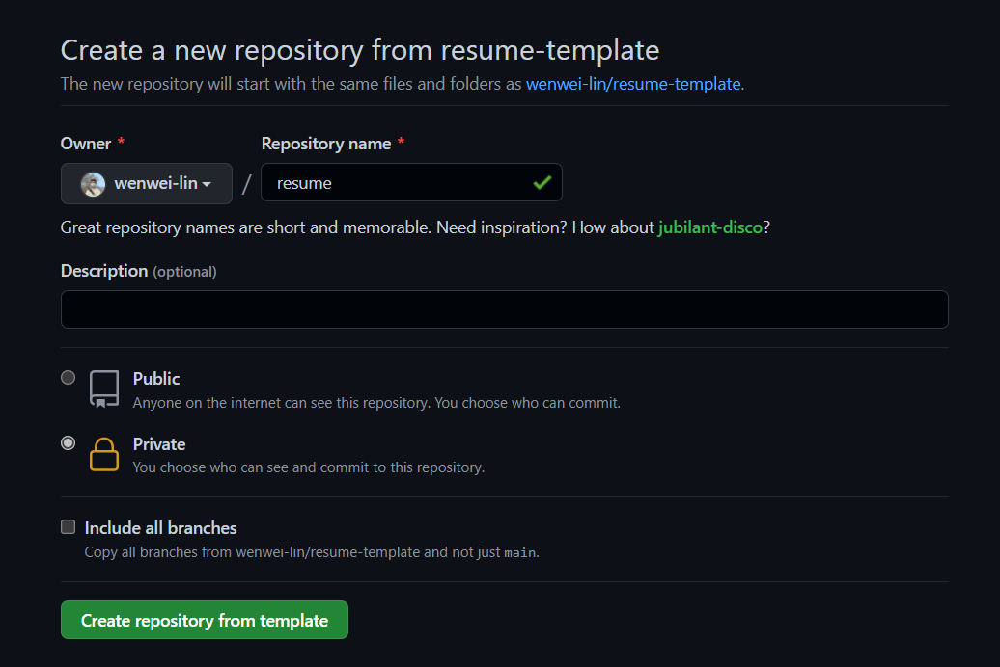
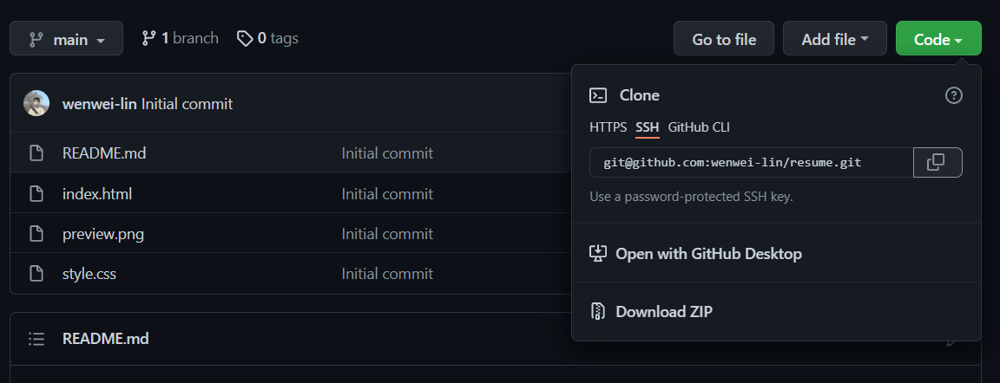
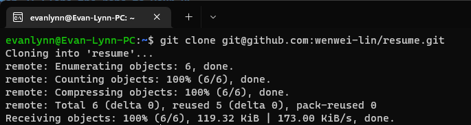
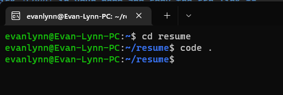
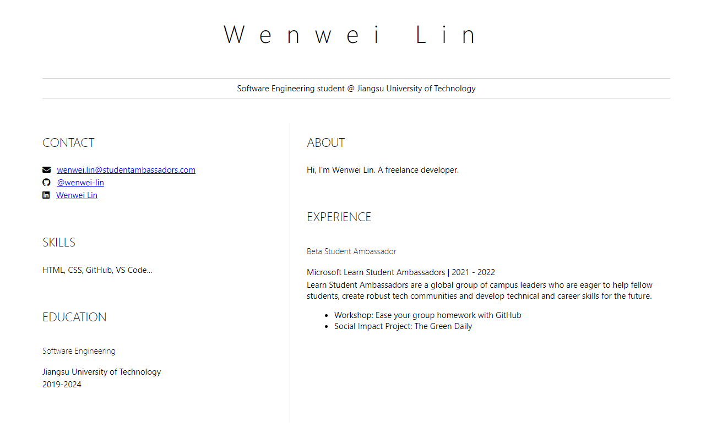
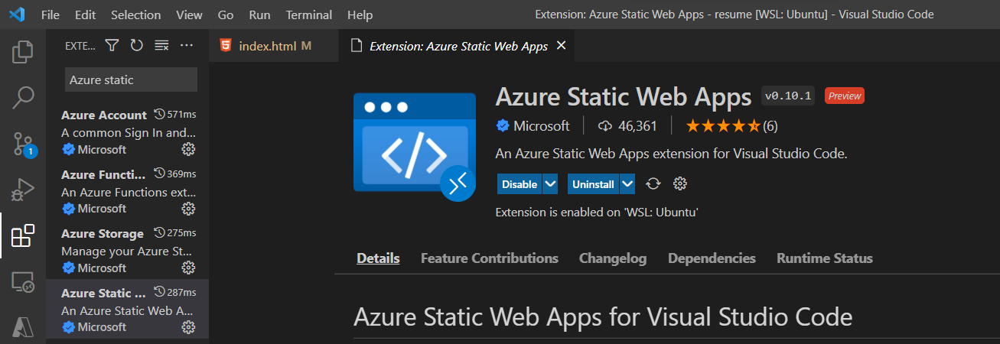
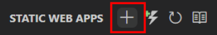
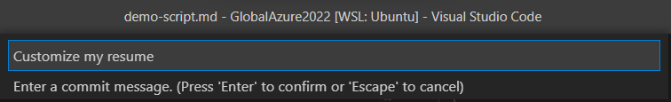

# Tutorial: Build your online resume using Azure Static Web Apps

In this tutorial, we will build an online resume from [template](https://github.com/wenwei-lin/resume-template/generate) and deploy it to Azure using Azure Static Web Apps service.

Before following this tutorial, make sure you have fulfill the prerequisites:

- A modern web browser like [Microsoft Edge](https://www.microsoft.com/edge?WT.mc_id=academic-51109-ornella) or [Google Chrome](https://www.google.com/chrome/)
- [Visual Studio Code](https://code.visualstudio.com/?WT.mc_id=academic-56895-chnoring)
- [Azure Static Web Apps VS Code Extension](https://marketplace.visualstudio.com/items?itemName=ms-azuretools.vscode-azurestaticwebapps&WT.mc_id=academic-56895-chnoring)
- [Git](https://git-scm.com/downloads)
- Azure account ([Free account](https://azure.microsoft.com/en-us/free/) or [Student account](https://azure.microsoft.com/en-us/free/students/))
- [GitHub account](https://github.com/)

Now, let start the journey!

## Step 1: Create an resume from template

Designing an resume website is a time-consuming work. To give you a kickstart, I create a resume template for you. 

Navigate [Create a New Repository from wenwei-lin/resume-template](https://github.com/wenwei-lin/resume-template/generate) page, and fill in *Repository name* to create the resume repo in your GitHub. You can set the repository availability as either Public or Private.



Click ***Create repository from template*** button to continue.

## Step 2: Clone the repo to your PC

To customize the resume, we need to edit the `index.html`. 

Since we will use [Visual Studio Code](https://code.visualstudio.com/?WT.mc_id=academic-56895-chnoring) in the following steps, it's better to clone this repo locally and push the repo after making changes.

> Note  
> You should make sure you have configured GitHub SSH connection.  
> Check out [GitHub Docs](https://docs.github.com/en/authentication/connecting-to-github-with-ssh/about-ssh) for more details.

**Click *Code* in your repo and copy the ssh link.**



**Open Shell in your computer and clone the repo to target location**

```bash
$ git clone <repo_url>
```



## Step 3: Edit the project with Visual Studio Code

Change your current directory to the repo, and use `.code` command to open Visual Studio Code.

```bash
$ cd <repo_name>
$ code .
```



Then open `index.html` in editor, and replace default value, like 'YOUR NAM', 'YOUR TITLE', etc. with your information.

After customization, open the `index.html` with the browser, and your resume will look like this:



## Step 4: Create an Azure Static Web Apps Service for your resume

Congrats! You've created your resume page! ***It's time to show it to world!***

1. **Install Azure Static Web Apps extension in Visual Studio Code**



2. Once completing, select the Azure logo in the Activity Bar to open the Azure extensions window.


> **Note: You are required to sign in to Azure and GitHub in Visual Studio Code to continue. If you are not already authenticated, the extension will prompt you to sign in to both services during the creation process.**

3. Under the Static Web Apps label, select the plus sign.



4. Commit the current change


5. Type commit message like "Customize my resume" and press \<Enter\>



6. 