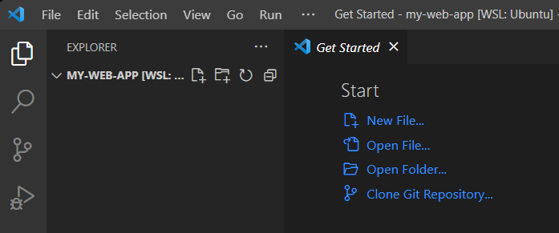
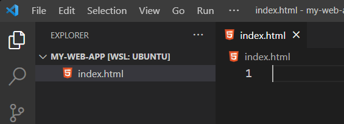
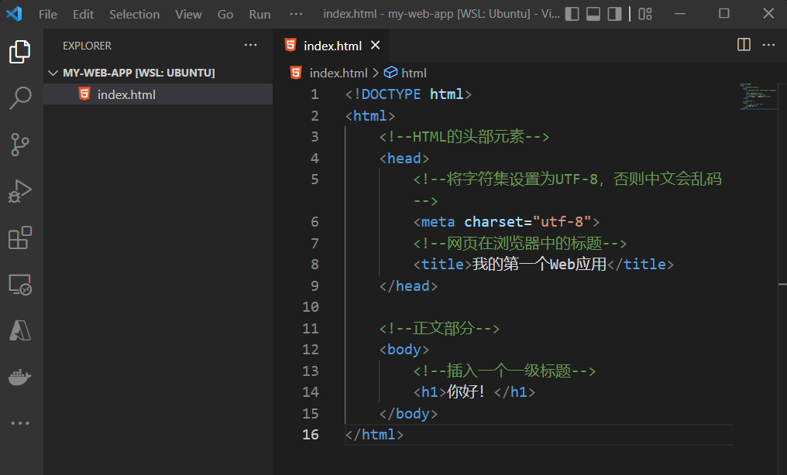
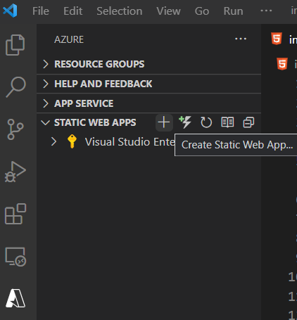

# 使用 Azure Static Web Apps 搭建第一个 Web 应用

Azure Static Web Apps 可以减轻你部署的烦恼。SWA 会与您的 Web 项目的代码仓库（[GitHub](https://github.com/)或者[Azure DevOps](https://azure.microsoft.com/en-us/services/devops/)）建立连接，每当仓库中的指定分支有新的提交时，SWA 会自动触发部署，更新您的 Web 应用。

下面我们来使用 SWA 部署一个简单的纯文本 Web 应用吧！

> **Note**  
> 在教程中，你将使用到如下内容
>
> - [Visual Studio Code](https://code.visualstudio.com/)
> - [Git](https://git-scm.com/book/zh/v2/%E8%B5%B7%E6%AD%A5-%E5%AE%89%E8%A3%85-Git)
> - [GitHub 账号](https://github.com/)
> - [Azure 账号](https://azure.microsoft.com/en-us/free/)  
> 
> 如果你是学生，可以通过edu邮箱注册，获得[Azure学生订阅](https://azure.microsoft.com/en-us/free/students/)。  
> 如果你的edu邮箱不在Azure的学校列表中，可以先 [激活GitHub Student Developer Pack](https://zhuanlan.zhihu.com/p/486024447)，再通过[GitHub激活Azure学生订阅](https://dev.to/mjmaurya/activate-azure-for-students-using-github-student-developer-pack-ad4)。

## Step 1 - 使用 Visual Studio Code 创建并开发项目

### 1.创建项目目录并使用 Visual Studio Code 打开

在电脑中的任意位置，创建文件夹，命名为`my-web-app`。然后，使用 Visual Studio Code 打开这个文件夹。

你也可以使用命令行完成这个操作：

```bash
mkdir my-web-app
cd my-web-app
code .
```

完成后，你会看到如下界面：



### 2. 在根目录新建文件index.html，并编写Web主页内容

在 Visual Studio Code 的 Explorer 中右击，选择"New File"，创建新文件。将这个文件命名为`index.html`。



在`index.html`文件中写入以下HTML代码

```html
<!DOCTYPE html>
<html>
    <!--HTML的头部元素-->
    <head>
        <!--将字符集设置为UTF-8，否则中文会乱码-->
        <meta charset="utf-8">
        <!--网页在浏览器中的标题-->
        <title>我的第一个Web应用</title>
    </head>

    <!--正文部分-->
    <body>
        <!--插入一个一级标题-->
        <h1>你好！</h1>
    </body>
</html>
```

这时，你的项目大致如下：



## Step 2 - 创建一个 Azure Static Web Apps 服务

### 1. 安装 Azure Static Web Apps 插件

在 Visual Studio Code 中[安装 Azure Static Web Apps 插件](https://marketplace.visualstudio.com/items?itemName=ms-azuretools.vscode-azurestaticwebapps)。

安装成功后，你的 Visual Studio Code 左侧导航栏会新增一个 Azure 图标。


### 2. 在 Visual Studio Code 中创建 Azure Static Web Apps 服务

点击左侧的Azure图标，之后选择"Static Web Apps"。当你把鼠标放置在Static Web Apps时，你会看到"Create Static Web App..."选项。

> **Note**  
> 此时，你需要登录你的GitHub账号，以及Azure账号。

